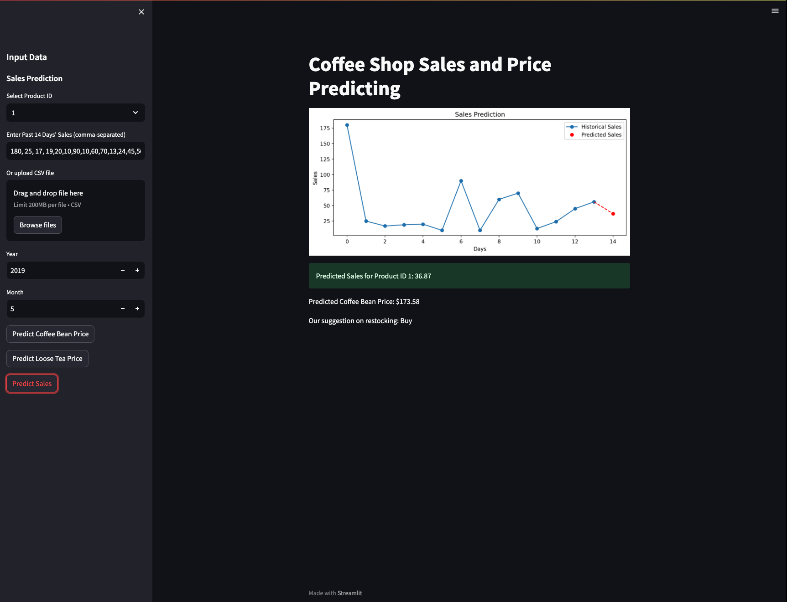

# Working with Data and Code A3

## Description
Ths project is a comprehensive data analysis and predicting project aimed at predicting product sales and commodity prices (specifically coffee and tea) for a coffee shop business. The project utilises historical sales data to forecast future demand for individual products and total sales. Additionally, it predicts coffee and tea prices using historical commodity price data. The project integrates machine learning models, including Support Vector Regression (SVR) for sales prediction and Linear Regression for price predicting.

The project also features an alert system to advise on restocking decisions based on predicted price trends in coffee and tea. A Streamlit-based web application serves as the user interface, allowing users to input data, view predictions, and receive restocking suggestions.

`pred.ipynb`: A Jupyter notebook file that conducts data preprocessing and model training. 

`app.py`: The Streamlit webapp.

## Usage

### Setting Up the Environment
To run the project, you need to have Python installed along with the following packages:
- Pandas
- NumPy
- Scikit-learn
- Joblib
- Matplotlib
- Streamlit

You can install these packages using the following command:
```bash
pip install pandas numpy scikit-learn joblib matplotlib streamlit

```
 To run the app use the following the command:
``` bash
python -m streamlit run app.py

```

### Sample output



